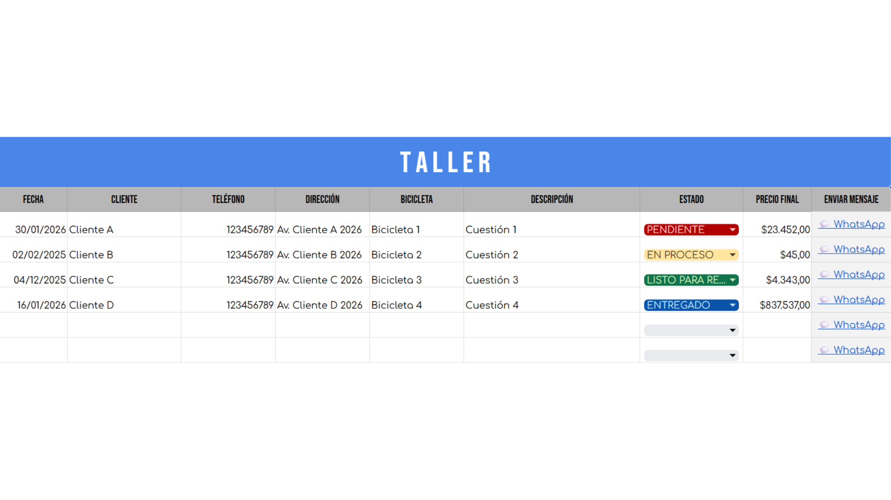
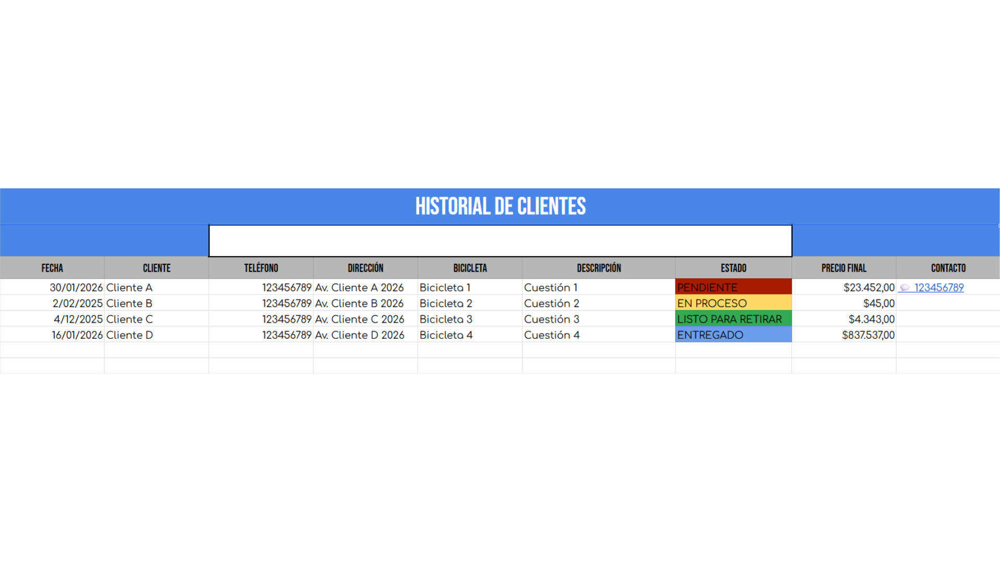
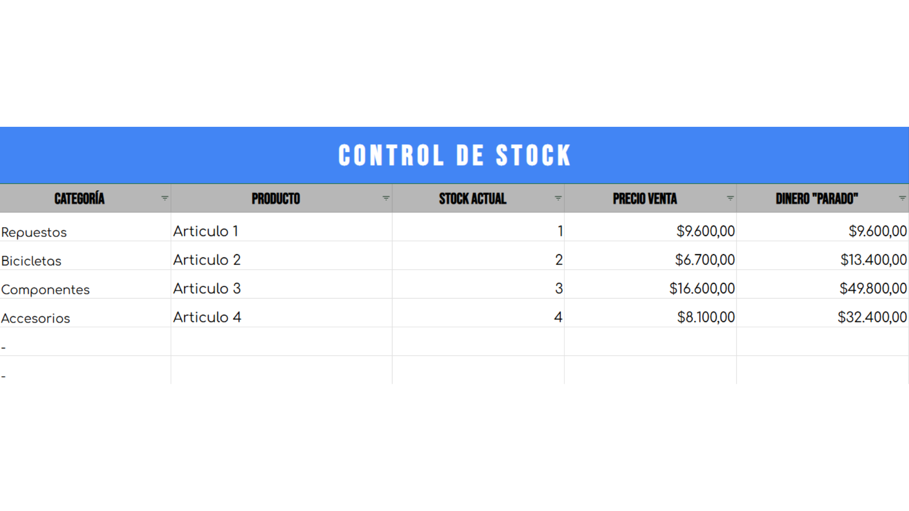
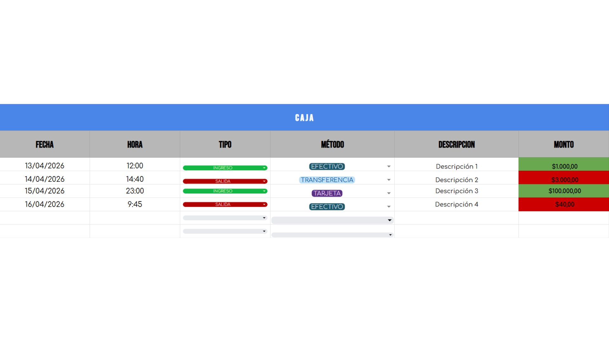

# 🚲 Sistema de Gestión Operativa y Taller - Mister Bike

## 📋 Sobre el Proyecto
Este proyecto consistió en la digitalización y modernización integral de un local comercial de bicicletas ("Mister Bike"). El objetivo principal fue migrar de un sistema de gestión analógico (basado íntegramente en papel) a un entorno digital centralizado.

**El Problema:**
La administración manual generaba pérdida ocasional de información, demoras significativas al buscar el historial de reparaciones de los clientes y dificultades para llevar un control exacto del stock y los flujos de caja diarios.

**La Solución:**
Diseño e implementación de un sistema de gestión basado en Google Sheets. Para optimizar el rendimiento y garantizar la integridad de los datos, el sistema fue diseñado aplicando separación de responsabilidades en **dos módulos independientes**: uno exclusivo para la dinámica del taller y otro para la administración de la tienda.

---

## 🛠️ Módulo 1: Gestión de Taller

Este módulo está enfocado en la trazabilidad de las reparaciones y la atención al cliente.

**Características principales:**
* Registro de ingreso y egreso de bicicletas.
* Seguimiento del estado de las reparaciones en tiempo real (Pendiente, En proceso, Listo para entregar, Entregado).
* Base de datos de clientes para agilizar el contacto, mantener el historial técnico y mejorar la fidelización.

### Capturas del Módulo Taller:

## 📦 Módulo 2: Administración y Tienda

Este módulo maneja la lógica de negocio, inventario y finanzas.

**Características principales:**
* Control automatizado de stock de repuestos y bicicletas.
* Registro de ventas directas.
* Control del flujo de caja (ingresos y egresos diarios/mensuales).

### Capturas del Módulo Tienda:

---

## 💻 Tecnologías y Herramientas Utilizadas
* **Google Sheets / Excel:** Fórmulas avanzadas, validación de datos, cruce de información y formato condicional para alertas visuales.
* **Lógica de Sistemas:** Diseño modular, separación de responsabilidades y estructuración de bases de datos relacionales simples.
